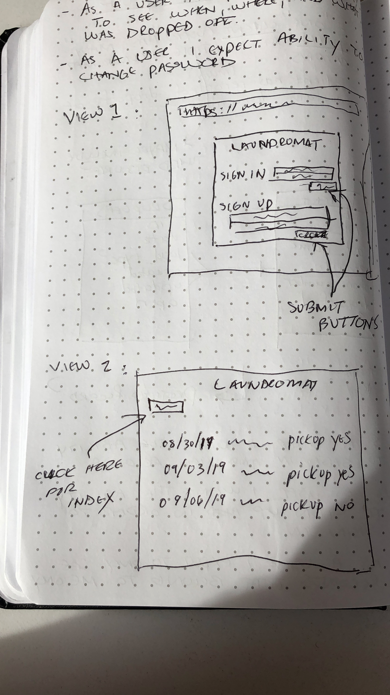
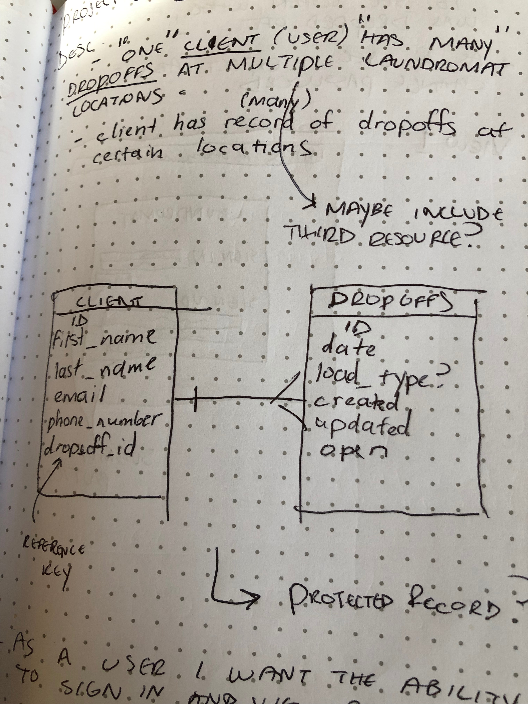
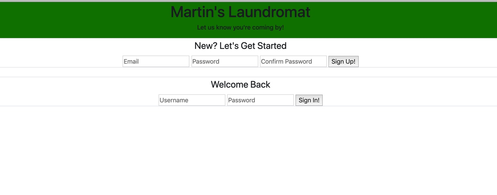
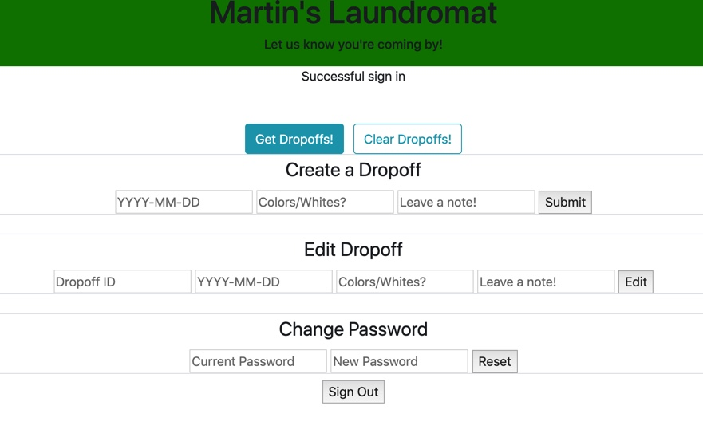
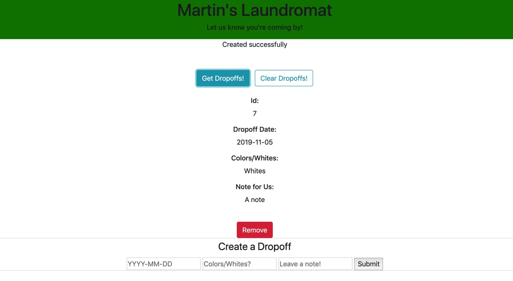

# Martin's Laundromat - FrontEnd
### By: Martin Rodriguez

## Description
```
Martin's Laundromat is a full-stack application that uses front end technologies such as HTML & CSS for styling and formatting, and Javascript for logic and event handling. The back-end is constructed using the Rails API server and framework, and Ruby as its technology.

This application uses a Protected Controller which allows each user to maintain full privacy and security when viewing, creating, deleting, and updating any data entry by requiring authentication.

Create a dropoff by entering a Date, Date of Dropoff, and a Note for the staff at Martin's Laundromat. When submitting, you can see record of your entry as well as any previous entries.
```
## User Stories
```
- As a user I want the ability to sign up in order to start using the dropoff form and maintain record of each
- As a user I want the ability to sign in and view unique records of any dropoffs in order to verify data is unique per user
- As a user I want the ability to see the date of every dropoff
- As a user I want the ability to edit any dropoffs
- As a user I want the ability to delete any record of dropoffs
```

## Wireframe and Game Pictures
```
Wireframe
```

```
ERD (one-to-many)
```

```
Screenshots of App:

Initial Launch
```


```
After Signing In
```

```
Creating a dropoff
```


## Timefames and Difficulties
```
- This application was created in a matter of 4 days (class time).
- A difficulty that I ran into was getting my PATCH request to work with the UI's
actual submission form.
- Incorporating handlebars to display the index for all the data was a challenge
as well considering the syntax alone was troublesome to understand.
```
## Future iteration and edits
```
- This app was inspired by a friend of mine who's manager is actually looking
for someone to create a SPA for their laundromat business... I used that idea as
a gateway for this project.
- In the near future I would like to expand on this idea as a potential product
for freelancing.
- I would like to incorporate Bootstrap for a much friendlier user experience and
welcoming theme.
```

## Technologies
```
HTML & CSS - for formatting and styling UI
Javascript
jQuery - for event handlers
Ajax - for making specific API requests to Heroku
Heroku - as the API
```

## Authors and Contributors
```
I wanted to thank not only my peers and consultants for the help and advice on
the project, but to my friend who provided a great idea at a coincidental time of
creating a simple application for a laundromat to be better organized and informed
of their incoming business.

Thank you all!
```

## Links to Repos, Heroku, Live Application

- https://github.com/mrodrz7/laundromat-frontend-client (Client repo)
- https://github.com/mrodrz7/laundromat-backend-api (API repo)
- https://mrodrz7.github.io/laundromat-frontend-client/ (Deployed Application)
- https://martins-laundromat.herokuapp.com/ (Deployed Heroku)
